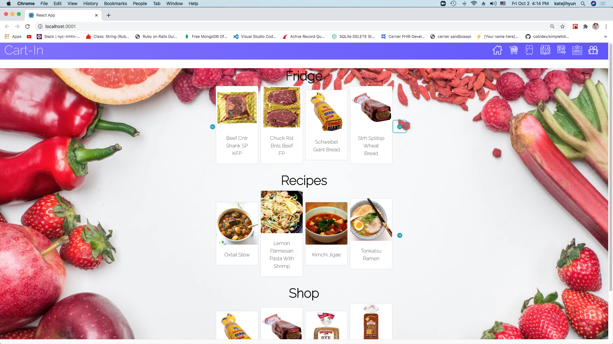
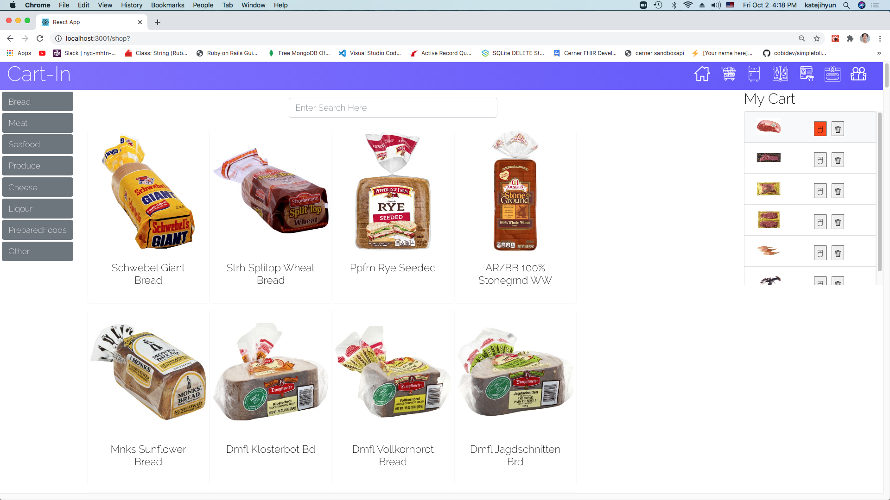
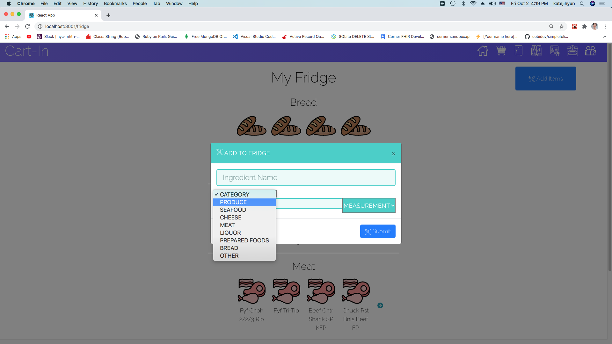
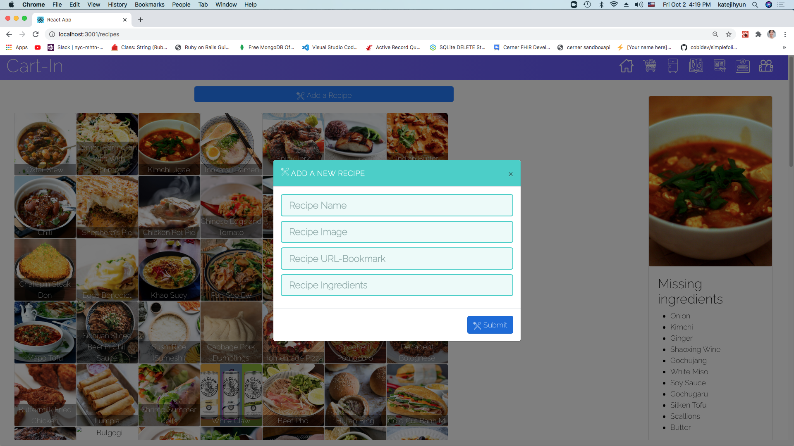
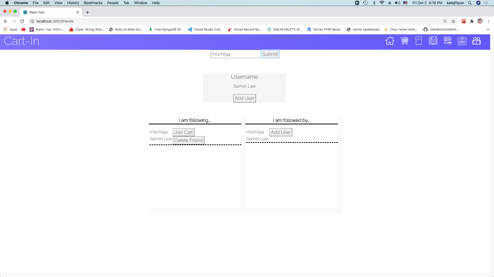
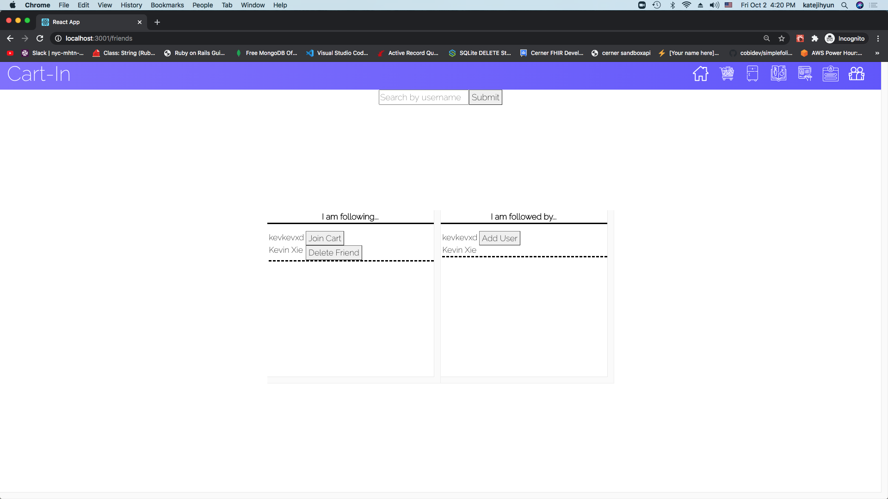

# Cart-In Mod4 Front-end

## About
- I was inspired to do this project while delivering groceries with Instacart. I've noticed that a lot of college students didn't use the app because the tip & delivery fee can be a burden to them. 

- This project is an extension of Mod 1 & Mod 3 projects of grocery E-commerce. Mod 1 Cart-in project is a Ruby used cli application, where user can shop and store items into his/her fridge and look up recipes using the fridge items. Mod 3 project used vanilla javascript to create a grocery e-commerce webpage. This project uses Rails on the backend and React front end to combine those two projects together.

## Included Features
- User can sign up/ log in using localStorage.
- User can add item to the cart, where user have an option to add the item to the fridge.
- User can add item to the fridge manually in the fridge page.
- User can click on his/her favorite recipe, where it will tell the missing ingredients according to the items the user has in the fridge.
- User can add friend to the friend list and the list also shows followed by list.
- Every user has his/her own item, fridge, and friend.

## Versions...
- npm 6.14.8
- yarn 1.22.4

## Used...
- React Bootstrap
- Wegman API
- Postman

## Stretch goals
- Add up to two friends to the cart, so 3 users pay equal amounts of tip, delivery fee, etc.
- Use websocket to make the adding/deleting items be live between users
- Implement Google Map API so that friends who are within amount of distance can be added to the cart.

## Getting started
- Clone the repository
- ```npm install``` or ```yarn install```
- https://github.com/Seminlee94/mod4project-backend Clone this back end repository
- Bundle install
- ```brew install yarn``` to install yarn
- ```rails db:migrate```
- ```rails db:seed``` after uncommenting lines 19~26, and change the category & sub_category in item.rb lines 74 & 75 to the approriate categories.
- ```npm start```

## Into the app
#### Sign up with username, password, name, and address. 

#### Once you signed up, you should see this home page, where fridge shows the items you have in the fridge, recipe, and items to shop. Let's view the shopping page. 

#### You can search the items with the search bar, or you can browse through the items of different categories using the sidebar. When you click on the item, it goes to the cart on the right side, in which you can delete or add the item to the fridge.

#### You can see that the item you have clicked was added to the fridge array. You can also manually add items into the fridge. Let's take a look at Recipe page.

#### Once you go to the recipe page, lists of recipes available will show up and if you click on the recipe, a box will show on the right side. In the box, you can see the missing ingredients. These missing ingredients are sorted out in accordance to the lists of items in your fridge. If you add any missing ingredient to your fridge, the item on the missing ingredient list will disappear. 

#### Lastly, let's take a look at the friend page. This was one of our stretch goals for the project. It uses the same concept as Twitter, where user has follower and followee. 

#### By comparing the two images, you can tell that one user has Se Min Lee as follower/followee and another user has Kevin as follower/followee. We can potentially use this to add any followed friend to the cart, so that you and your friends can shop with one cart and divide the tip, and delivery fee.


## Developeres
### Se Min Lee
- email: seminlee2794@gmail.com
- github: https://github.com/Seminlee94
- linkedin: https://www.linkedin.com/in/se-min-lee-149188105/
- medium: https://medium.com/@mlsml94
- portfolio: https://seminlee94.github.io/semin/

### Kevin Xie

# Demo
- Coming Soon!

## Please check out Se Min Lee's previous demos and projects.
#### Demo
- https://www.youtube.com/watch?v=sn4SqkDkPZQ&t=62s << Flatiron Consulting
- https://www.youtube.com/watch?v=TVFmlVFrffw&t=5s << Shop N Cook
- https://www.youtube.com/watch?v=58Dlbg41p70 << WALL-E
#### Github Codes
- cdemarti/mod2_final_project << code for Flatiron Consulting
- https://github.com/jakelozano94/ruby-project-guidelines-nyc01-seng-ft-071320 << code for Shop N Cook
- https://github.com/abeciana1/wal-e-frontend << WALL-E(Front end)
- https://github.com/abeciana1/wal-e-backend << WALL-E(Back end)
